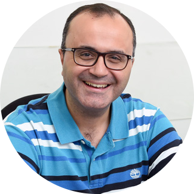

# Computer Programming (COE 211): Spring 2023

## Link to course webpage

The material of the course can be downloaded from the course's [webpage](https://wissamfawaz.github.io/lau-coe211-computer-programming/)

## Logistics

- **Lectures**: T/Th 9:30 a.m. - 10:45 a.m. and 2:00 p.m. - 3:15 p.m.
- **Locations**: Zakhem Eng. 507 (Morning) and Zakhem Eng. 509 (Afternoon)
- **Office hours**: T/Th 11:00 a.m. - 1:00 p.m. and W 10:00 a.m. - 12:30 p.m.

## Overview

### What is this course about?

This is an introductory programming course with an emphasis on algorithm development, programming constructs, computer organization, data representation, debugging, and program testing. A wide range of numerical as well as non-numerical problems relating to engineering will be solved in Java as a means towards reinforcing the understanding of these concepts.

## Instructor (Dr. Wissam Fawaz)

